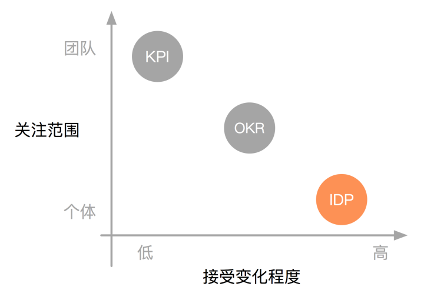
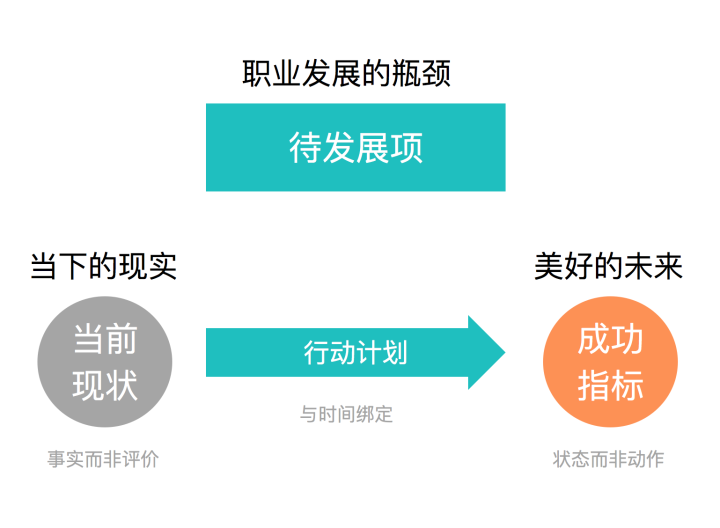

# IDP

## 是什么

IDP（Individual Development Plans）个人发展规划，是指导团队成员提升个人能力的工具。

IDP关注的**主体是团队中的每个成员**，核心**目的是提高个体的能力**，构成要素如下：

- 待发展项
- 当前现状
- 成功指标
- 行动计划

## 不是什么

- 不是团队发展规划向个人维度的分解
- 不用于绩效考核
- 不强调完成度
- 也不会由团队 Leader 分派

|  工具   |   用途   | 核心目的     | 关注主体  | 接受变化 | 绩效考核 | Review | 收集方式 |
| :-----: | :------: | ------------ | :-------: | :------: | :------: | :----: | :------: |
| **IDP** | 个人发展 | 提升某些能力 |   个人    |    高    |    无    |   无   | 自下而上 |
| **OKR** | 设定目标 | 达到某种状态 | 团队/个人 |    中    |    无    |   有   | 上下结合 |
| **KPI** | 绩效考核 | 完成某些指标 |   团队    |    低    |    有    |   有   | 自上而下 |

## 如何制定

- **质量好坏的标准是**：待发展项是不是个人职业发展的瓶颈所在，是否以事实为依据
- **成功指标是：** 否让人有动力，行动计划是否与时间绑定

### 1. 待发展项

- 是对于个人而言最需要提高的能力，而不是对整个团队最重要的能力

- 一定要是个人职业发展的瓶颈所在，**通常不会超过 3 项**

- 不用团队中的每个人都一样，**是高度差异化的**

### 2. 当前现状

- 认清现实是推动改变的基础，分析或规划要以事实为依据

- 要客观地描述某项能力相关的实际情况，尽量描绘事实本身，而不是对事实的评论或者分析
  - 比如 **“辅导团队成员的能力很弱”** 就是典型的评论而非描述
  - 而 **“从未对团队成员进行过一对一指导”** 就是对现实情况的描述

### 3. 成功指标

- 是待发展项得到提升之后，个人应该达到的状态

- 它描绘的是你未来的状态，这个状态应该是美好的，激动人心的，有挑战性的，而不能是呆板且常规的

- 要是具体的，可衡量的，甚至可以是充满细节的，这样才能够以此判断现实与目标的差距，激发改进的动力

  

制定成功指标有两个常见的错误，一个是持续达成，一个是指标与行动不分

#### ※ 持续达成

- 由于一个指标的描述过于模糊，或者过于简单，**导致任何时候都可以认为这个指标已经完成了**
  - 比如 “业务理解程度更深” 都是典型的持续达成的指标
  - 不需要做任何额外的努力，只要在工作，对于业务的理解就会更深，这种指标一直都在达成

- 持续达成的指标指引不了行动，是没有意义的

#### ※ 指标与行动不分

- 行动是达到指标的途径，而不是指标本身，两者不能混淆
  - ‘比如 “每天跑步” 是行动，“体重减轻10%”是指标
  - 减重才是你想要达到的状态，跑步只是途径之一

- 如果行动代替了指标，那么就会导致指标随着行动的完成而完成
- 指标是否完成，要以现实为依据，我们要改变的是现实，而不是通过行动自我满足

### 4. 行动计划

- 行动计划要能够落地，关键在于要与时间绑
- 与时间绑定有两种方式，一种是设截止日期，一种是设时间循环
  - 一个行动，要么是在某个截止日期前完成
  - 要么是以某个周期循环执行，两者必选其一
- 不与时间绑定的行动计划只是一堆代办事项，而不是计划

## 如何辅导

### 要求

- **Leader** 与 每名成员 每半个季度 安排一次 1v1 的沟通辅导，每次不少于 20分钟
- **成员** 提前更新好 IDP 文档，对自身发展充分思考，准备好问题
- 辅导结果落实在 IDP 文档中

### 内容

- 回顾本阶段的工作表现，说明 **优点和缺点**
- 对成员的 **待发展项给出指导意见**
- Review 相关指标与行动 **计划的细节**
- **解答疑问**，收集团队成员的建议

### 注意

- IDP 一定要通过 **1v1 沟通** 持续提高质量
- 团队成员要充分理解 IDP 的意义，**从自身角度出发**，先给 IDP 打好基础
- 团队 Leader 只起到辅导作用，**不能由 Leader 直接制定 IDP**
- IDP **可以是公开的**，团队中每个成员都能相互看到

## 参考模板

| 当前现状 现在有哪些瓶颈 | 待发展项 发展的能力,美好的未来 | 成功指标 如何衡量是否成功 | 行动计划 完成时间 | 资源支持 需要哪些资源、特许 | 回顾时间 Review |
| :-------------------------------------: | :-------------------------------------------: | :------: | :------: | :------: | :------: |
| 1 | 1 |          |          |          | / |
| 2 | 2 |          |          |          | / |
| 3 | 3 |          |          |          | / |

## Read More

- [技术团队如何制定个人发展规划（IDP）](https://zhuanlan.zhihu.com/p/28133037)
- [扫盲贴|IDP是什么？今天带你了解个人发展计划！](https://zhuanlan.zhihu.com/p/336687573)